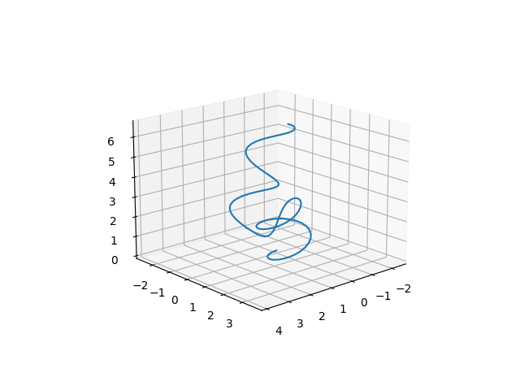

# アルゴリズムについて
## 概要
もじゃもじゃ生成アルゴリズムは次の2段階からなります。 
1. 曲線を生成
1. 曲線を螺旋に変換

## 曲線を生成
うねうねした曲線を生成します。 
始点から螺旋状の曲線を引きます。ただし右巻き、左巻きを交互にランダムな間隔で切り替えます。すると下のような曲線が生成されます。 
 
ニッポニテス（いわゆる異常巻きアンモナイト）の殻生成メカニズムを参考にしています。 

## 曲線を螺旋に変換
曲線の概形を保ったまま粗密ある螺旋に変換します。
ステップ関数

## 実装
生成は[curve_geerator.py](./curve_generator.py)、螺旋への変換は[curve_twister.py](./curve_twister.py)で行っています。