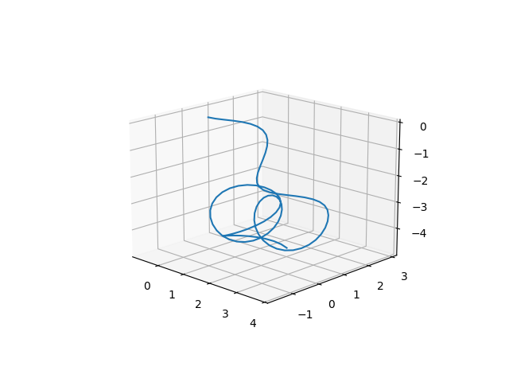
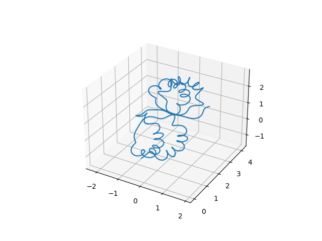

# mojagen
mojamoja generator<br>
もじゃもじゃを生成するpythonパッケージです。<br>
未完成です。<br>
ニッポニテス（いわゆる異常巻きアンモナイト）の殻を参考にしています。


## 依存
Matplotlib<br>
NumPy<br>
SciPy


## 使い方
```bash
python3 mojagen.py
```
以下、オプション引数です。<br>
後述のもじゃもじゃ生成アルゴリズムの章
|オプション引数|型|概要|
|:--|:-:|:--|
|-p<br>--plot|フラグ|グラフを表示|
|--length|float|もじゃもじゃの長さ|
|--sample|int|サンプリング点の数|
|--torsion|float|もじゃもじゃの大まかな曲がり具合|

## 実行例
<br>
<br>
<br>


## 参考
ニッポニテスは下記ツイートの画像がわかりやすいです。<br>
[https://twitter.com/tukunosuke/status/1051782570650755073](https://twitter.com/tukunosuke/status/1051782570650755073)


## ライセンス
MITライセンスです。<br>
[LICENSE](./LICENSE)を参照ください。
