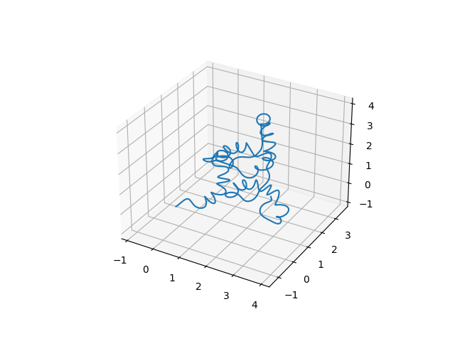
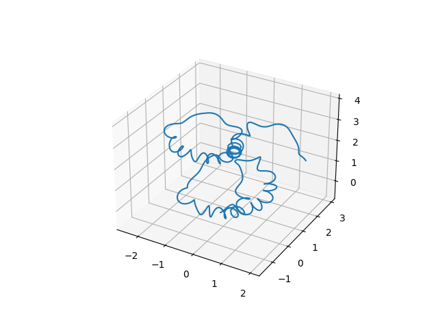

# mojagen

## 概要
mojamoja generator<br>
もじゃもじゃを生成するpythonパッケージです。<br>
未完成です。<br>
次の2段階を経てもじゃもじゃした曲線を出力します。   
1. 右巻き螺旋、左巻き螺旋を組み合わせて曲線を生成
1. 曲線を粗密ある螺旋に変換

なお1段階目はニッポニテス（いわゆる異常巻きアンモナイト）の殻の生成メカニズムを参考にしています。<br>


## 依存
Matplotlib<br>
NumPy<br>
SciPy


## 使い方
```bash
python3 mojagen.py
```
以下、オプション引数です。<br>
|オプション引数|型|概要|
|:--|:-:|:--|
|-p<br>--plot|フラグ|グラフを表示|
|--length|float|もじゃもじゃの長さ|
|--sample|int|サンプリング点の数|
|--torsion|float|大まかな曲がり具合|
|--radius|float|細かな螺旋の半径|
|--freq|float|細かな螺旋の周波数|

## 実行例
いずれも```python3 mojagen.py -p --sample 1000 --torsion 0.2 --radius 0.2 --freq 7```で実行
<br>
<br>
<br>


## 参考
ニッポニテスは下記ツイートの画像がわかりやすいです。<br>
[https://twitter.com/tukunosuke/status/1051782570650755073](https://twitter.com/tukunosuke/status/1051782570650755073)


## ライセンス
MITライセンスです。<br>
[LICENSE](./LICENSE)を参照ください。
